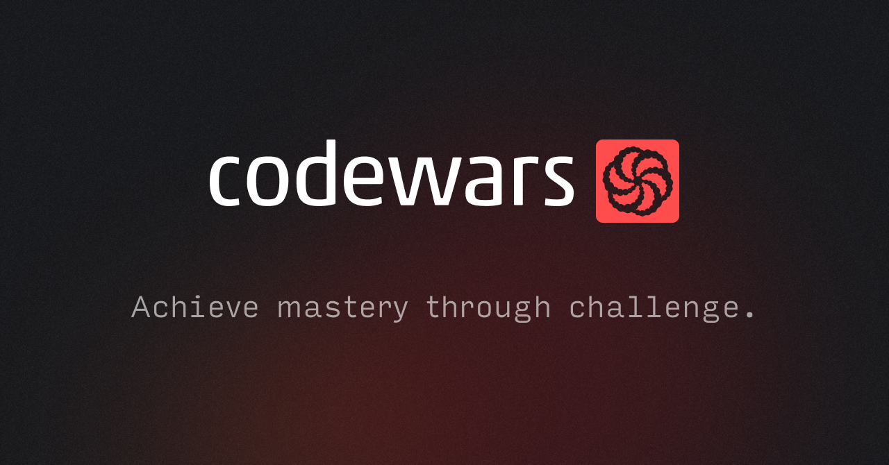

# CodeWars Algorithm Challenges Repository

## Description
Welcome to my repository of algorithm challenges from [CodeWars](https://www.codewars.com)! This repository contains a collection of solutions for various algorithmic problems across all difficulty levels, ranging from basic to advanced. Each solution is implemented in Java and is accompanied by thorough unit tests using JUnit to ensure code reliability and correctness.

## Technologies Used
- Java 17
- Gradle
- JUnit

## Getting Started

### Prerequisites
- Java 17
- Gradle (for building and managing dependencies)

### Cloning the Repository
To clone this repository and run the algorithms on your local machine, follow these steps:

1. Open your terminal.
2. Navigate to the directory where you want to clone the repository.
3. Run the following command:
`git clone https://github.com/mattnicee7/Codewars`
4. Once cloned, you can open the project in your favorite IDE that supports Gradle projects (e.g., IntelliJ IDEA, Eclipse).

## Repository Structure
- Each algorithm challenge is organized into its own directory.
- Inside each directory, you will find the implementation of the algorithm and its corresponding JUnit test cases.

## Running the Tests
To run the unit tests and verify the solutions:
1. Navigate to the root directory of the project in your terminal.
2. Run the following command:
`./gradlew test`

## Note on Contributions
This repository is currently not open for pull requests or issues. It is a personal project to track my progress and solutions for algorithm challenges on [CodeWars](https://www.codewars.com).

## Acknowledgments
- Thanks to [CodeWars](https://www.codewars.com) for providing a platform with such diverse and challenging problems.